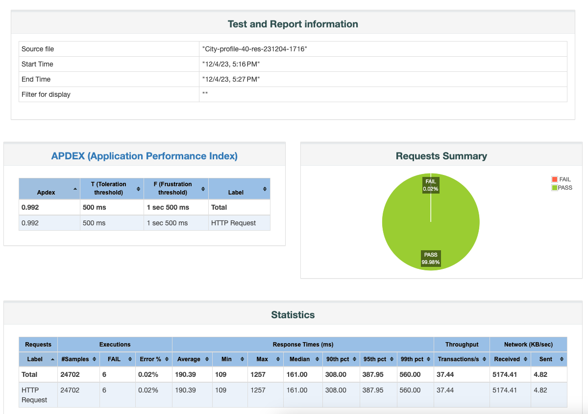

# Домашнее задание №3

**Задача:**

1. Разработать профиль нагрузки для системы
2. Реализовать профиль на любом инструменте НТ (разработать скрипт)
3. Задать нефункциональные требования по производительности к системе (SLO/SLA)
4. Найти максимальную производительность системы
5. Написать краткий вывод: где достигнута максимальная производительность, где узкое место в системе, для подтверждения привести графики.

## 1. Профиль нагрузки

 
  Описание SRE Course API и реализации тестовой конфигурации
  

> SRE course weather API обеспечивает доступ к БД "weather" с таблицами "cities" и "forecast".
> 
> Доступные запросы:
> 
> - Cities: GET /Cities/{id}; PUT /Cities/{id}; POST /Cities; GET /Cities
> - Forecast: GET /Forecast/{id}; PUT /Forecast/{id}; POST /Forecast/{cityId}; GET /Forecast
> - WeatherForecast: GET /WeatherForecast

 
  Наполнение тестовой базы API 
  

> **Table Cities:** 170 записей. Список  городов России с населением более 100 тыс.
> **Table Forecast:** 1190 записей. Список записей о прогноза погоды на 7 дней для каждого города.

 
  Компоненты системы 
  

> - Ingress Controller (3 pods)
> - HAProxy (1 VM)
> - PosgreSQL, patroni (2 VMs)
> - etcd (3 VMs)
 

------------

Предполагается, что пользователи будут встраивать код, использующий API, в свои приложения и веб-сайты.
Профили, использующие GET:

>1. CitySelect: Получение списка городов для выбора и сохранения идентификатора города в настройках клиентского приложения. (GET /Cities).
>2. City-1: Получение и вывод прогноза погоды для одного города на текущую дату. (GET /Forecast)
>3. City-7: Получение и вывод прогноза погоды для одного города на неделю. (GET /Forecast)
>4. Russia-1: Получение и вывод прогноза погоды для всех городов на текущую дату. (GET /Cities; GET /Forecast)
>5. Russia-7: Получение и вывод прогноза погоды для всех городов на неделю. (GET /Cities; GET /Forecast)

Для Нагрузочного Тестирования целесообразно **использовать профили "City"**. Эти профили предсматривают автоматическое выполненеие по событию или по таймеру и могут генерировать существенную нагрузку.

Остальные профили предусматривают интерактивный режим запуска и существенно меньше нагружают сервис API.

## 2. Реализация профиля НТ City на Jmeter

Для реализации профиля используется файл JMeter test plan City-profile-xxx.jmx со следующими элементами:

"HTTP Request defaults": http://91.185.85.213/
"HTTP Header Manager": Host:weather.sre.student12
"Throughput Shaping Timer": sets request rate shcedule
"jp@gc - Ultimate Thread Group"
"HTTP Request": path: /forecast/
~~"Constant Timer": Thread delay: 300~~ - не использовался
- Start RPS: 1, End RPS: xxx, Duration: 600
- Start RPS: xxx, End RPS: 0, Duration: 30

## 3. Нефункциональные требования к системе по производительности

Для нашего API я определил следующие SLI:
- Время отклика (ms)
- Пропускная способность: количество запросов (RPS)
- Уровень ошибок: процент запросов

SLO:
- 95% запросов должны быть выполнены в течение 500 мс
- пропускная способность 100 RPS
- менее 1% запросов должно приводить к ошибке

## 4. Максимальная производительность системы

Для определения макс. прозводительности состемы подготовлен НТ профиля City c постепенным увеличением RPS с 1 до 100.  
1. [Test plan до 100 RPS; "City-profile-100.jmx"](./City-profile-100.jmx) 

Тестирование выявило появление ошибок при нагузке около 50 RPS. Т.о. максимальная производительность системы 50 RPS.

2. [Полные результаты теста](City-profile-100-rep-231204-1535/index.html)

Выполнение теств профиля City c нагруpкой 40 RPS подтвердил стабильную работу системы с нагрузкой 80% от максимальной.

3. [Test plan до 400 RPS; "City-profile-40.jmx"](City-profile-40.jmx) 

4. 

5. [Полные результаты теста "City-profile-40](City-profile-40-rep-231204-1716/index.html)

## 5. Вывод

Система не удовлетворяет заранее определенным параметрам, но **обеспечивает следующий фактический SLO**:
- 95% запросов должны быть выполнены в течение 500 мс
- пропускная способность **40 RPS**
- менее 1% запросов должно приводить к ошибке

------------

Тестирование не выявило узких мест _backend_:

- максимальная нагрузка CPU на любой VM системы не превышала 14%
- максимальная сетевая нагрузка на любой VM системы не превышала 50 Mbit/sec

- мониторинг PostgreSQL не показал проблем производительности

Однако были выявлены **проблемы c общей производительностью системы и Ingress Controller**:

------------

### Предложения по улучшению системы:

1. Улучшить логику работу API и исключить "тяжелые" запросы.
    - в текущей реализации API невозможно получить данные о прогнозе погоды по выбранному городу. Поэтому для получения пррогноза выполняется непараметризованный запрос GET, который выдает прогноз погоды для всех городов, т.е. все содержимое таблицы forecast. В тестовой конфигурации объем **GET responce > 1400 bytes**.
    - добавление параметризованного запроса по конкретному городу позволит существенно увеличить производительность системы без использования допонительных ресурсов.
    - для тестирования предложения создан нагрузочный тест, который возвращает единственную запись таблицы forecast. В результате отмечено **снижение "веса" GET response до 267 bytes**. И увеличение максимальной производительности до 100 RPS:
    
2. Выделить дополнительные ресурсы Kubernetes.
3. Уменьшить постороннюю нагрузку на Ingress Controller. 
    - при наблюдении за системой отмечались ухудшения параметров Ingress Controller во время, когда не проводилось нагрузочное тестирование. Предполагается, что это вызвано нагрузкой от других систем, использующих общий ресурс Ingress Controller.

